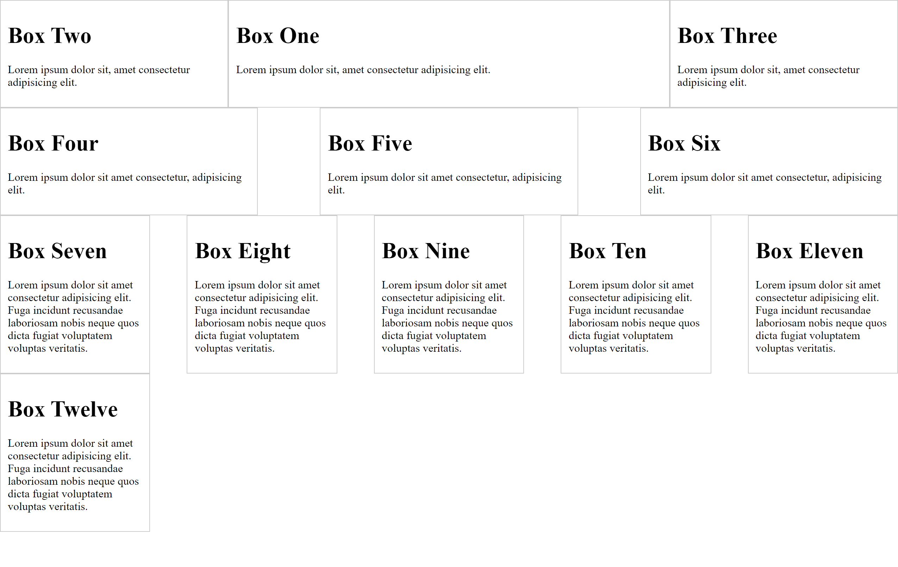

# HTML&CSS - Flexbox CSS in 20 Minutes

### About

This quick project covers the CSS Flexbox model. This covers the basics such as display:flex, flex, order, flex-direction, justify-content, flex-basic, and align-items.

### Acknowledgement

Thanks to Traversy Media for this just-ok tutorial.  honestly not his best.  felt incomplete.

